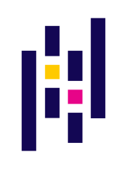

# 
Hey there 🙋‍♂️

My name is <b>Patrik</b>

 

    I am a graduate computer science student at
    <b>
        <a href="https://fit.cvut.cz/en" style="color: #EF5B0C;">FIT CTU</a>
    </b> and

    a software developer & analyst at
    <b>
        <a href="https://www.target-technologie.cz/en/" style="color: #EF5B0C;">Target Technologie</a>
    </b>

 

    
      

 

 

      

-----------

### 
My projects run on

    
 Languages 

    

        
        
        
        
        
        
        
        
        
        
        
        
        
    

    
 Frameworks and Libraries 

    

        
        
        
        
        
        
        
        
        
    

    
 Services 

    

        
        
        
    

    
 Stuff 

    

        
        
        
        
        
    

